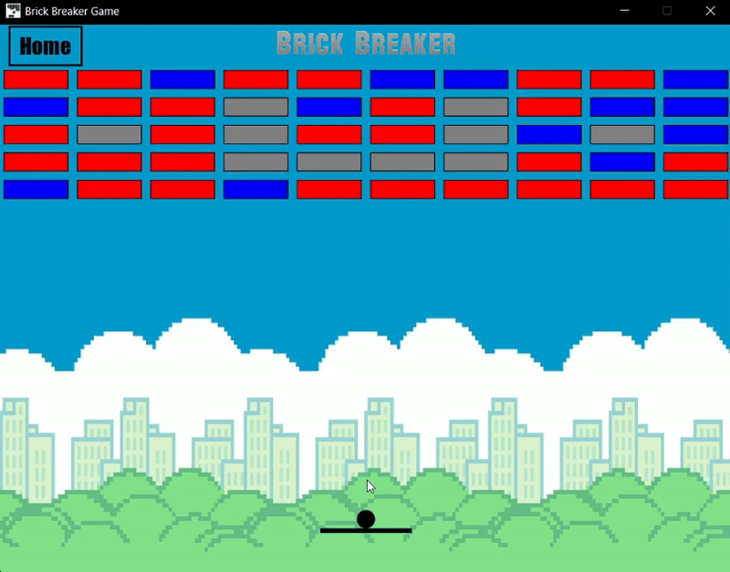
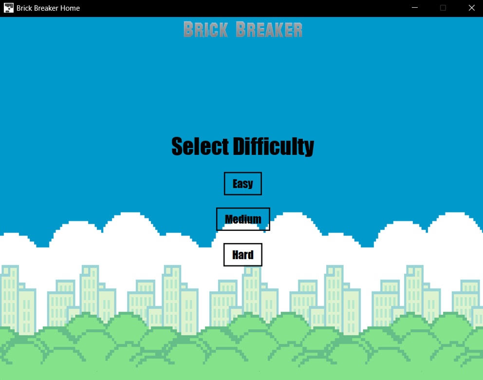
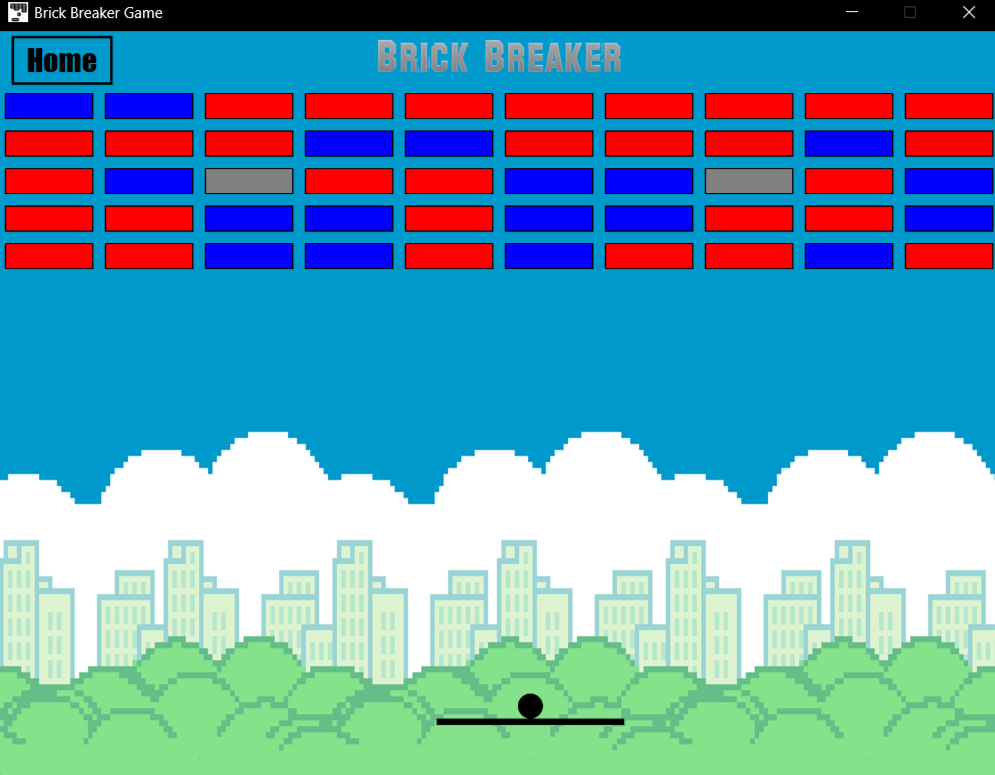
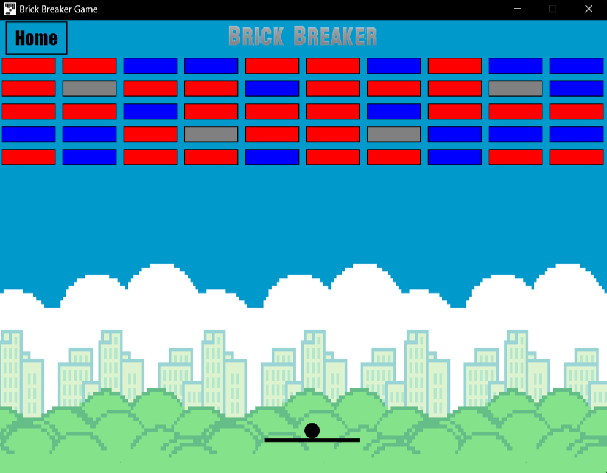
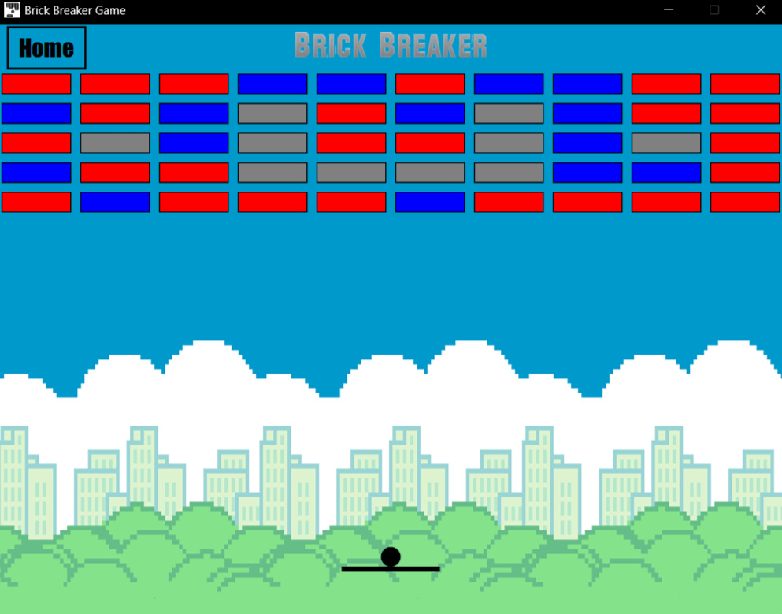

# 🧱 Brick Breaker Game (JavaFX)

A classic Brick Breaker (Breakout-style) desktop game built using JavaFX.  
Smash all the bricks with the ball while controlling the paddle!



## 🎮 Features

- 🧠 Multiple brick types: breakable, unbreakable, strong
- 🎯 Collision detection with paddle, wall, and bricks
- 💥 Smooth animations and sound effects
- 🏁 Win and game over screens
- 🏗️ Object-oriented structure with modular design

## 🌄 Overview

| Home Page | Easy Level |
|-----------|------------|
|  |  |

| Medium Level | Hard Level |
|--------------|------------|
|  |  |

## 🛠 Tech Stack

- `Java`
- `JavaFX`
- `FXML` for UI layout
- `Maven` for project management


## 📁 Project Structure

```markdown
brick-breaker-javafx/
│ pom.xml
├───.vscode/
├───src/
│ ├───main/
│ │ ├───java/com/example/
│ │ │ ├─── App.java
│ │ │ ├─── Ball.java
│ │ │ ├─── Brick.java
│ │ │ ├─── Paddle.java
│ │ │ └─── Home.java
│ │ └───resources/
│ │ ├─── Background.jpg
│ │ ├─── Icon.png
│ │ └─── *.fxml
└───target/
```


## 🚀 How to Run

### ✅ Prerequisites
- Java 11 or later
- Maven installed

### ▶️ Run using Maven

Now go to your project root (demomavinfx) and run:

```bash
mvn clean javafx:run
```
